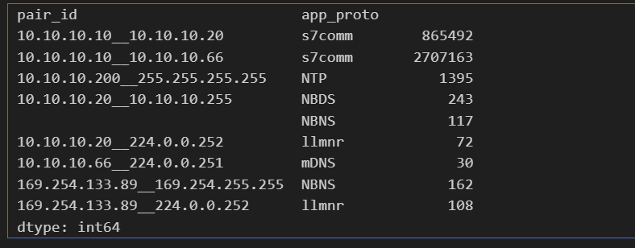
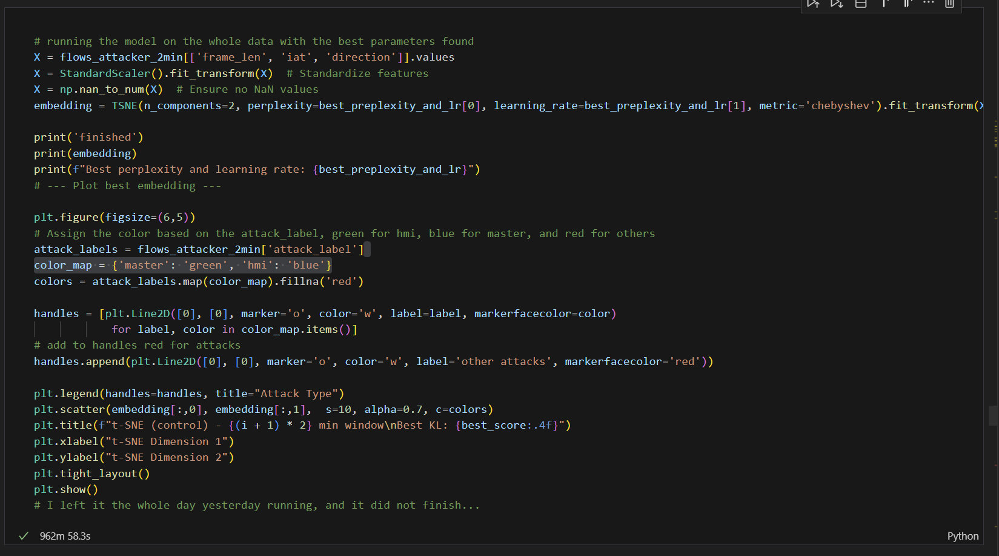
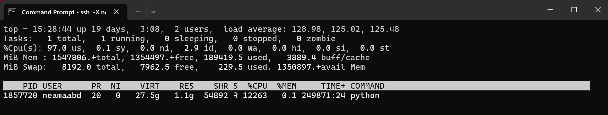

- Duration for running t-sne
  - 

- Processing of task2 on the whole dataset: 
  - 
- 
| البند                 | معناه                                                                                                   |
| --------------------- | ------------------------------------------------------------------------------------------------------- |
| **PID = 1857720**     | ده رقم البروسيس، لو عايز تقتله تستخدمه                                                                  |
| **USER = neamaabd**   | انت اللي مشغّله                                                                                         |
| **VIRT = 27.5g**      | البروسيس حاجز **27.5 جيجا** virtual memory (مش معناها إنه مستخدمها فعليًا)                              |
| **RES = 1.1g**        | الذاكرة الفعلية اللي واخدها من الـ RAM (حوالي 1.1GB)                                                    |
| **S = R**             | البروسيس شغال (Running)، مش sleeping ولا idle                                                           |
| **%CPU = 12185**      | الرقم هنا إجمالي عبر كل الـ threads. بما إنه السيرفر multi-core فالرقم ده ممكن يوصل أضعاف الـ100%       |
| **TIME+ = 249716:47** | ده عدد **ساعات CPU** اللي استخدمها — رقم ضخم جدًا (يعني البروسيس شغال فعليًا من زمن طويل وعصر CPU جامد) |
| **COMMAND = python**  | السكريبت اللي شغال هو `task2_script.py`                                                                 |
