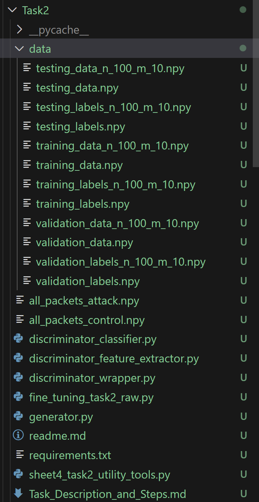

- Script in this folder is used to finetune GAN on raw bytes, and output the best metrics, and also the best generator and discriminator model.
- To use run the following command: 
  - > pip install -r requirements.txt
  - python fine_tunining_task2_raw.py --n {number of bytes} --mode {D, or G}
- You must ensure that you have data folder containing training, validation, and testing data similar to this image: 
  - 
- Also ensure that you have the .npy files for normal and attack in the same level of the script
  - all_packets_attack.npy
  - all_packets_normal.npy
- Finally ensure that GPU 1 is empty, as it is the one used for the training. 