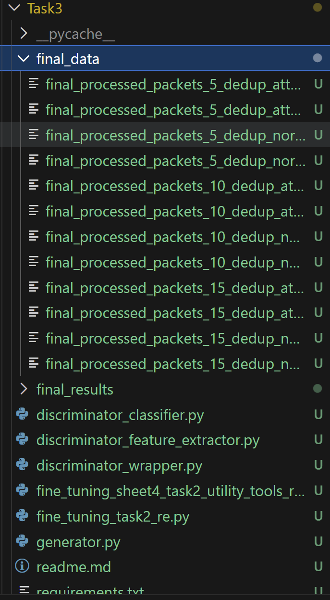

- Make sure you installed all necessary libraries
  - > pip install -r requirements.txt
- There are two main scripts here
1. First one for running N-gram experiment
   - To run it use this command: 
     - > python task3_sheet4_ngrams_modifications.py {n}
2. Second one for running finetuning on GAN on re data
   - To run it use this command: 
     - > python .\fine_tuning_task2_re.py --n {bytes value} --mode {D, or G}
   - Make sure you have final_data on in the folder
     -   