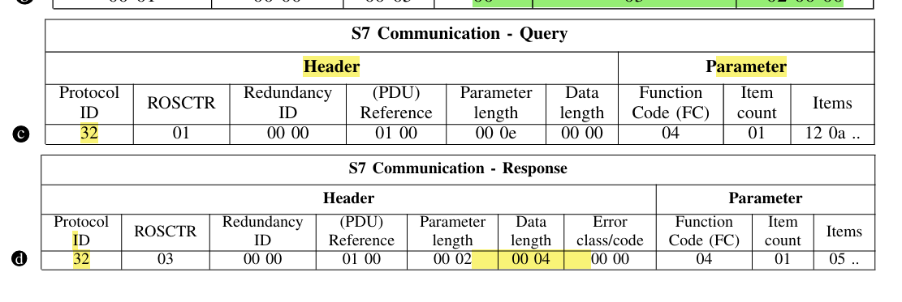
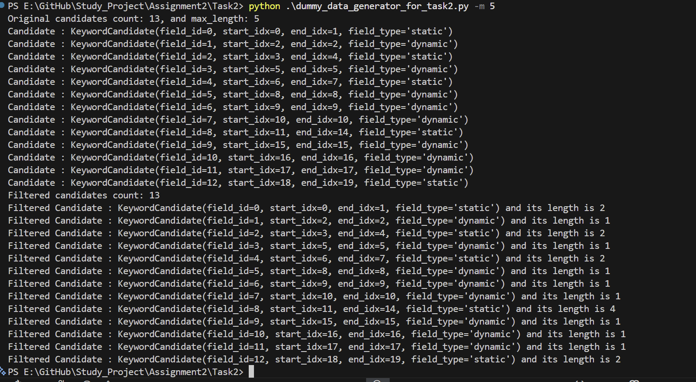
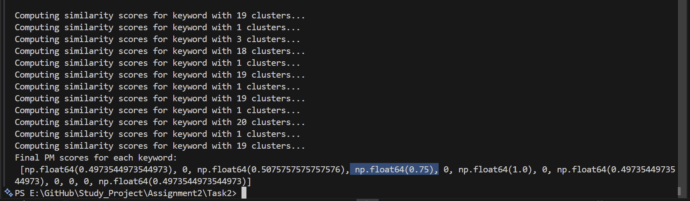
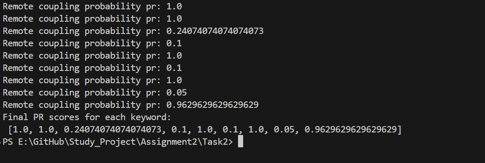
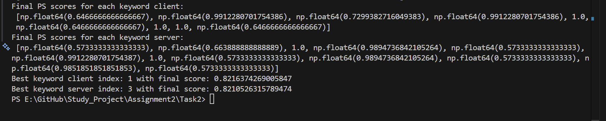
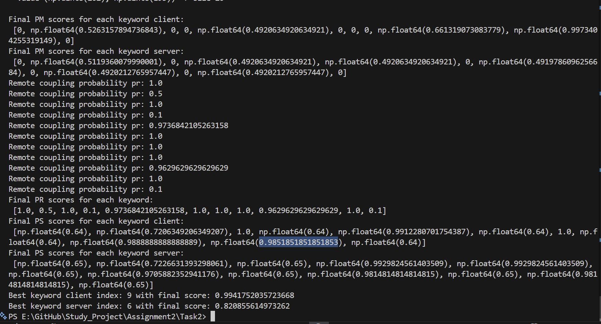

## Analysis notes
- 

## Experimental results:
- Running task a with max_len = 5
- 

## Computing PM Scores
- 

## Computing the Pr Scores
- 

## Computing Ps Scores and the best scores
- 

## All probabilities together for task 2.b
- 