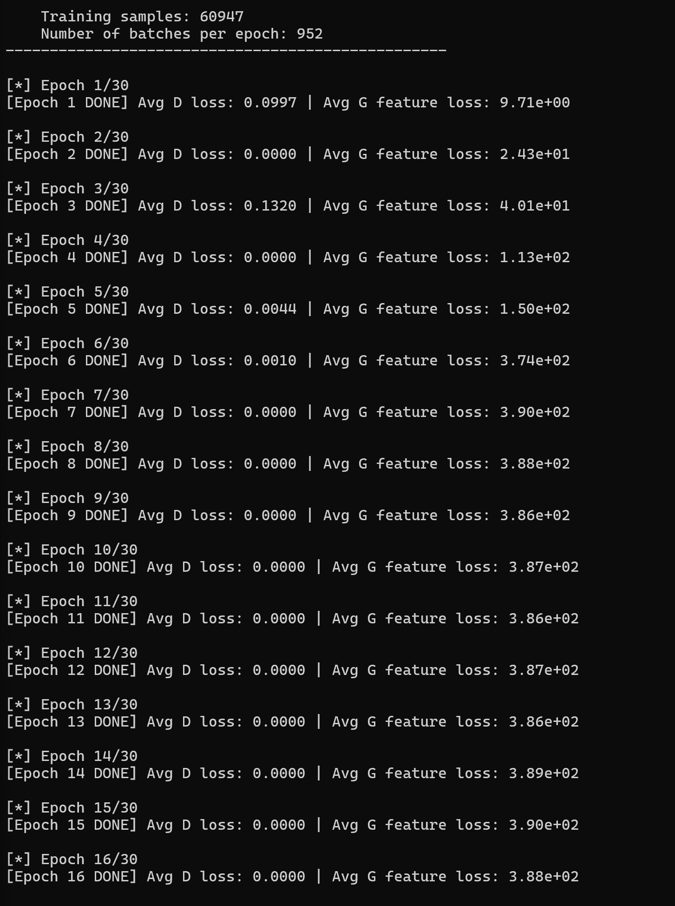
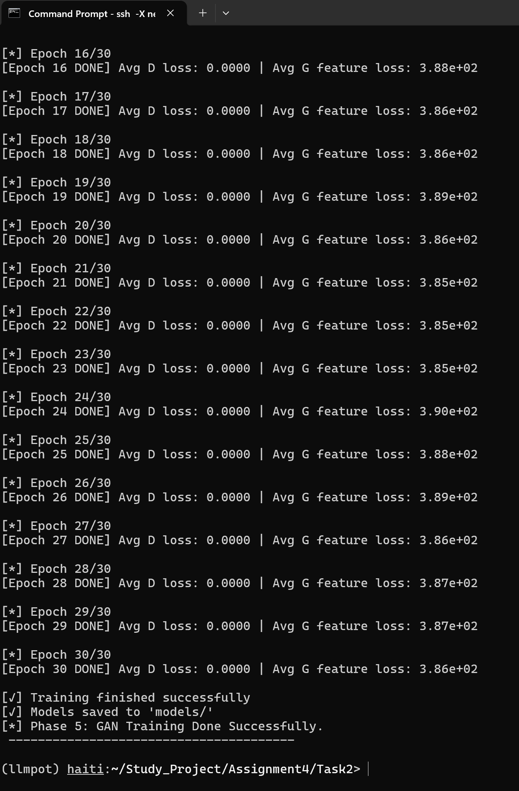

## Training GAN Results:
- 
- 
- After training on the dataset, I found that D is saturated and almost predict all normal packets correctly, which G gets pushed farther instead of closer, so L2 distance between feature vectors keep increasing until it reaches stable ceilts almost 390. 
- So I will try now to fix this issue by modifing the learning rates of D and G.
- First inference results:
  - Testing on test data...
[D-mode] Precision: 0.9900 | Recall: 0.4193 | F1: 0.5891