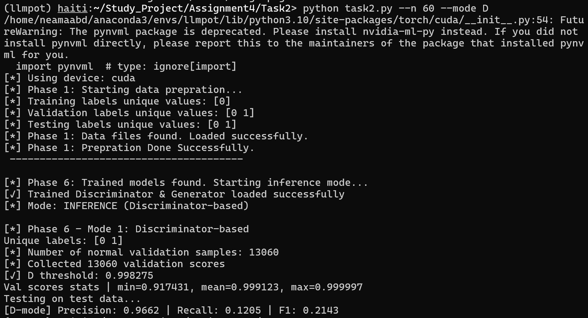
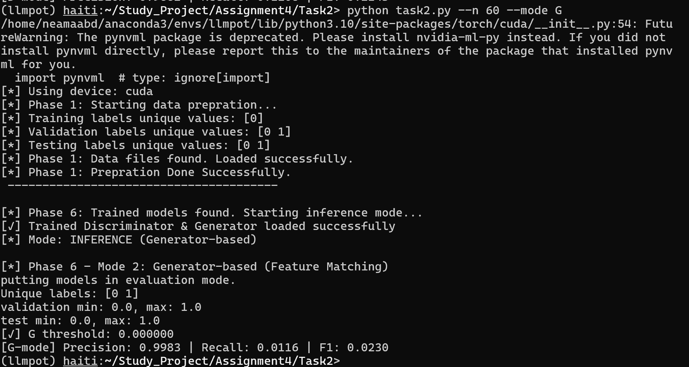

## Training GAN Results:
- 
- 
- After training on the dataset, I found that D is saturated and almost predict all normal packets correctly, which G gets pushed farther instead of closer, so L2 distance between feature vectors keep increasing until it reaches stable ceilts almost 390. 
- So I will try now to fix this issue by modifing the learning rates of D and G.
- First inference results:
  - Testing on test data...
[D-mode] Precision: 0.9900 | Recall: 0.4193 | F1: 0.5891
- Second inference results with sigmoid at the end:
  -   [*] Phase 6 - Mode 1: Discriminator-based
  Unique labels: [0 1]
  [*] Number of normal validation samples: 13060
  [*] Collected 13060 validation scores
  [✓] D threshold: 1.000000
  Val scores stats | min=1.000000, mean=1.000000, max=1.000000
  Testing on test data...

## Best results
- To achieve a stable and meaningful inference setup in Phase 6, several training strategies were systematically explored. First, the discriminator and generator were trained in a standard alternating manner (one update of the discriminator followed by one update of the generator per batch). However, this led to rapid dominance of the discriminator, with its loss quickly converging to zero, while the generator failed to learn effectively and exhibited unstable or uninformative behavior. Second, the generator was trained multiple times per batch while keeping the discriminator update unchanged, in an attempt to compensate for this imbalance. Although this slightly altered the training dynamics, the discriminator still dominated and the final anomaly-detection performance remained poor. Third, the learning rates were adjusted by decreasing the discriminator learning rate and increasing the generator learning rate, which resulted in more stable loss curves and delayed discriminator convergence. Nevertheless, despite improved training stability, the final inference results were still unsatisfactory, as the discriminator continued to classify most samples as normal and the generator-based score showed very low recall. Finally, an adaptive training strategy was introduced, where discriminator and generator updates were controlled based on discriminator loss thresholds: when the discriminator learned too quickly, its updates were temporarily frozen to prevent dominance, while the generator continued training, and vice versa. This adaptive approach produced the most stable training behavior and enabled meaningful inference analysis in Phase 6, forming the basis for the final evaluation.
- Best results I achieved: 
  - For D:
    - 
  - For G:
    - 
- From the obtained results, it can be observed that the generator-based inference mode exhibits very high precision, meaning that whenever the generator classifies a packet as anomalous, this prediction is almost always correct. However, the generator suffers from extremely low recall, indicating that it fails to detect a large portion of anomalous packets. In contrast, the discriminator-based inference mode also achieves high precision, while its recall remains limited; nevertheless, it is approximately an order of magnitude higher than that of the generator-based mode. This indicates that the discriminator features are more sensitive to subtle deviations from normal behavior than the generator-based prototype distance. Overall, despite stable training and careful tuning, the GAN-based approach in this one-class setting proves to be overly conservative and misses a significant fraction of anomalies. Therefore, it can be concluded that, for this dataset and attack characteristics, the GAN model is not well suited as a standalone anomaly detector, as it fails to achieve adequate recall and overlooks a substantial number of anomalous packets.