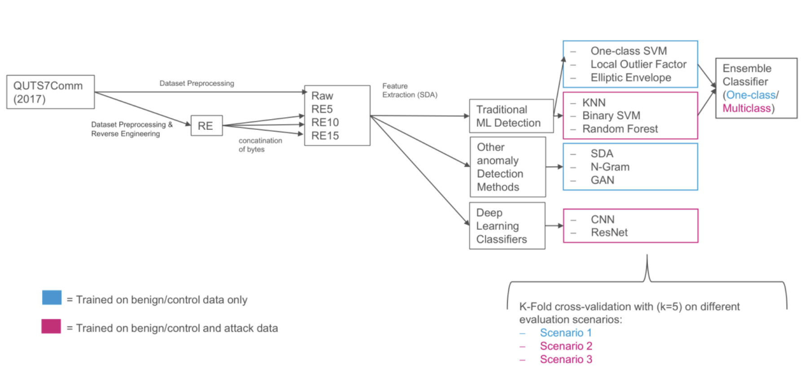

# Adversarial Machine Learning for Anomaly Detection in Industrial Control Systems

This repository contains the implementation and experiments conducted
for the study project:

**"Adversarial Machine Learning: Use of Reverse Engineering for Anomaly
Detection in Industrial Control Systems"**

conducted at the **Chair of IT Security, Brandenburg University of
Technology (BTU), Germany**.

Authors: - Abdelaziz Neamatallah - Anna Dembowski

Supervised by: - Prof. Dr.-Ing. Andriy Panchenko - Asya Mitseva, M.Sc.

------------------------------------------------------------------------

# Overview

Industrial Control Systems (ICS) are critical infrastructures used in
sectors such as energy, manufacturing, and transportation. Due to their
importance, these systems are increasingly targeted by cyberattacks.

This project investigates **machine learning--based anomaly detection
techniques** for identifying malicious behavior in ICS environments. It
also explores how **reverse engineering and adversarial machine learning
concepts** can be used to evaluate and analyze anomaly detection
systems.

The goal is to understand the strengths and limitations of ML-based
security mechanisms in industrial environments.

------------------------------------------------------------------------

# Project Objectives
-   Study anomaly detection techniques used in Industrial Control
    Systems.
-   Apply machine learning models to detect abnormal system behavior.
-   Analyze the robustness of these models against adversarial
    techniques.
-   Evaluate model performance using standard machine learning metrics.

------------------------------------------------------------------------

# Topics Covered

-   Machine Learning fundamentals
-   Supervised and unsupervised learning
-   Overfitting and underfitting
-   Distance functions for anomaly detection
-   K-Fold cross validation
-   Evaluation metrics (F1-score)
-   Deep learning approaches for anomaly detection
-   Statistical dataset analysis
-   Security considerations for Industrial Control Systems

------------------------------------------------------------------------

# Technologies Used

-   Python
-   PyTorch
-   NumPy / Pandas
-   Scikit-learn
-   Matplotlib / Seaborn

------------------------------------------------------------------------

# Procedure Overview

------------------------------------------------------------------------

# Methodology

The project follows a typical machine learning workflow:

1.  Data preprocessing\
2.  Feature engineering\
3.  Model training\
4.  Model evaluation using metrics such as F1-score and cross
    validation\
5.  Security analysis with adversarial machine learning techniques

------------------------------------------------------------------------

# Installation

> Clone the repository:

> git clone https://github.com/abdelazizSalah/Study_Project 

------------------------------------------------------------------------

# Project Report PDF

For deeper understanding have a look on our [report pdf](./Study_Project_Final_Report.pdf)
------------------------------------------------------------------------

# License

This project is intended for **academic and research purposes**.

------------------------------------------------------------------------

# Acknowledgments

This project was conducted as part of a **study project at Brandenburg
University of Technology (BTU)** under the supervision of the **Chair of
IT Security**.
