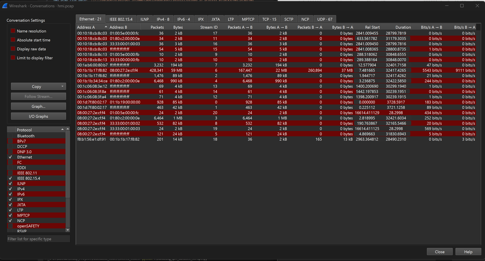

- In the first task, should we also use electra_s7comm ? because it was mentioned that we should handle only pcap files, however electra is .csv

## Task2 questions
- Should we use only the LabeledDataset, because it is the one with the pcap files.
- Should we merge all the pcap files in one dataframe, or can we handle each file separatly. 
- It was mentioned in the task sheet that all flows should have the same length, but also in the next sentece it was mentioned that we should not lose information for the longer flows, so how is that possible ? should we truncate the flows to be of specific size or the data is generate in form of having same length for all flows. 
- If I have X and Y communicating on s7comm and modbus/TCP for example, a traffic flow would be from X to Y on S7comm, and another would be from Y to X on S7comm, or they both considered as one single traffic flow?
  - I assume that it will be bidirectional, so both X->Y and Y->X will be combined in single flow.
- It is not possible to load the whole data in one Dataframe, so should we use chunks ?
- Is that what you want to see as traffic flow but using python script instead of using 
  -  
- Regarding the point of  **You should differentiate between flows containing
 packets under attack and those without attacks**, you mean that folder of attacks, and the folder of control, or you mean the attacker.pcap in each folder should be gathered together? because in the control we still have attacker.pcap also.
  - I assumed that you meant the folder of attacks should be handled separatly from the folder of control.
- Some packets we have undetected protocols for them, should we drop them? 
- What do you mean by direction?
  - I showed the src_ip and the dst_ip.
- How do I know if my results are correct or not?
- Should we also include the direction in terms of MAC addresses, or only on level of IP. 