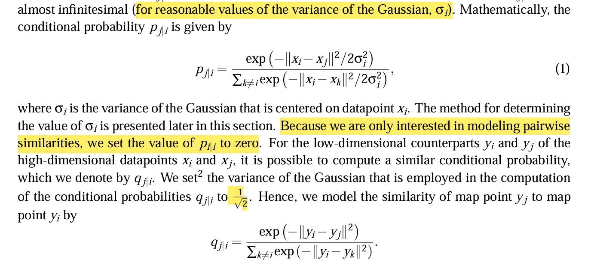
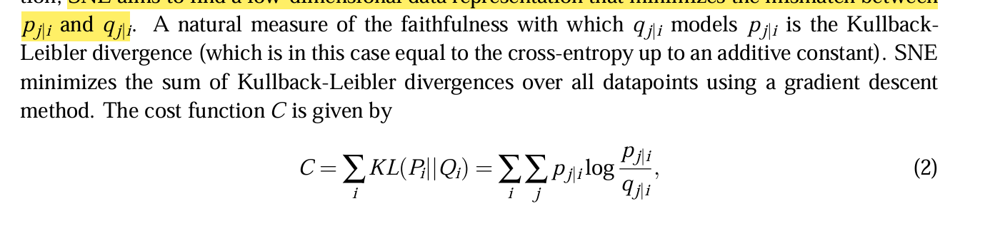
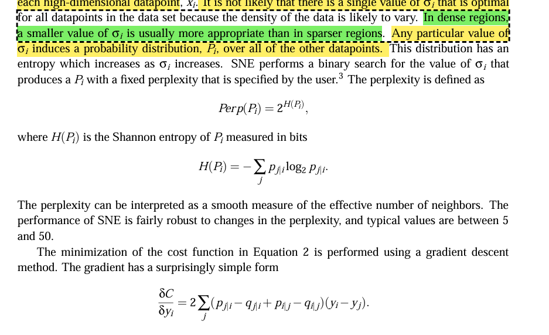
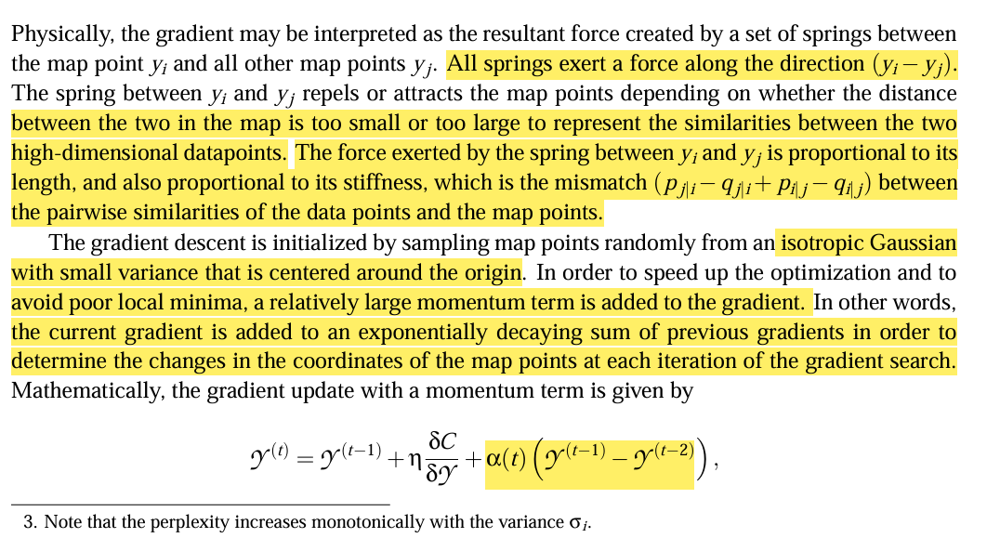
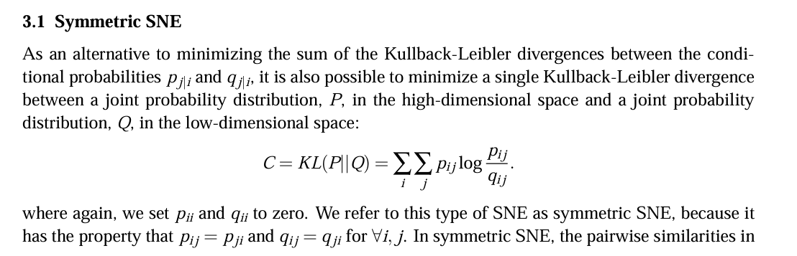

- What is TSNE? 
  - It is a visualization method for high-dimensional data.
- Usually they use dimensionality reduction to reduce the features from high-dimension to two or 3 dimensions only to be able to visualize it. 
- Also this reduced features tries to keep as much of significant structure of the high-dimensional data as possible.
- So, we should convert the high-dimensional dataset into a matrix of pair-wise similarities, and then use t-SNE to visualize the resulting similarity data. 
- SNE is short for Stochastic Neighbor Embedding
  - it convert the high-dimensional Euclidean distances between datapoints into conditional probabilities that represents similarities. 
  - The similarity of datapoint xj to datapoints in high dimension xi is the conditional probability pj|i, that xi would pick xj as it neighbor if neighbors were picked in proportion to thier probability density under a Gaussian centered at xi. 
  - For nearby datapoints, pj|i is relatively high, wheras for widely separated datapoints, it should be almost 0. 
  - The conditional probabilty follows this equation
    - 
  - For the low-dimensional counterparts yi and yj should also follow the same equation, and if the low-dimensional data were good, then pj|i should be equal to qj|i.
  - So SNE aims to find a low-dimensional data representation that minimizes the mismatch between pj|i and qj|i. 
  - So to measure that they use Kullback Leibler divergence 
    - 
  - Because this cost function is not symmetric, so it has very high cost for widely spread datapoints, and low cost for nearby map points, which keep the local structure of data in the map, and the clusters still appears. 
  - The other parameter to be selected is the variance of the Gaussian that is centered over each high-dimensional datapoint. 
  - It is not likely that there is a single value of the variance that is optimal for all datapoints because the density of the data likely vary. 
  - In dense regions, a smaller value of sigma is usually more appropriate than in sparser regions. 
  - Any value of sigma will induce a probabilty distribution over all the other datapoints. 
  - SNE performs binary search for the value of sigma that produces probability distribution which is fixed by perplexity which is specified by the user.
    - 
  - The gradient is interpreted as a resultant force created by a set of springs between one map point yi, and all other map points yj. 
  - All springs exert a force a long the direction of (yi - yj)
  - The spring attract or repel a map point depending on  the distance and the stiffness of the spring
  - which is the mismatch (pj|i - qj|i + pi|j - qi|j)
  - Then it is initialized by sampling map points around the origin, then keep trying to achieve the global minimum. 
  - To avoid the poor local minima, they add relative large momentum to the gradient, so this is the final equaiton
    - 
    - t is the iteration
    - n is the learning rate
    - alpha(t) is the momentum at iteration t
## t-Distributed Stochastic Neighbor Embedding
- Although SNE constructs good visualizations, its cost function is difficult to optimize. 
- So they created the t-SNE, it uses a cost function which is : 
  - Symmetric and with simpler gradients 
    - 
  - Uses Student-t distribution instead of Gaussian to compute the similarity between two points in the low-dimensional space